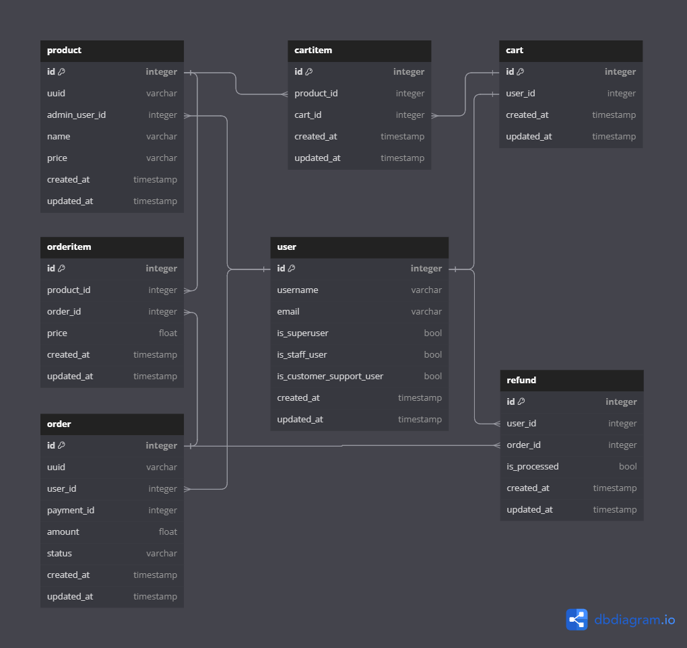

# ShopCartush - An E-Commerce Project in Django


## Database Schema


# Overview
This project is an E-Commerce Backend API built using Django Rest Framework. It provides functionalities for admin users to manage products and for regular users to browse, add to cart, and purchase products.


# Features
- **JWT Authentication:** Implemented JSON Web Token (JWT) authentication for secure user authentication and authorization.
- **Product Management:** Admin users can create, update, and delete products.
- **User Authentication:** Users can register, login, and manage their accounts.
- **Product Listing:** Users can browse through available products.
- **Cart Management:** Users can add products to their cart and manage their cart contents.
- **Checkout:** Users can proceed to checkout and place orders.
- **Order History:** Users can view their order history.

# API Endpoints

## Authentication:
```
/auth/register/: User registration.
/auth/login/: User login.
/auth/logout/: User logout.
/auth/activate/<uidb64>/<token>/: Activate account
/token/refresh/: New Refresh Token
```
## Admin Dashboard and Products:
```
/admin_dashboard/products/: List of all products and Create New products.
/admin_dashboard/products/image_upload/: Upload images related to products
/admin_dashboard/notifications: Create a new product.
```

## Users and Cart:
```
/cart/: User's cart details.
/addtocart/: Add a product to the cart.
```

## Orders:
/orders/: Place Order

# Swagger Documentation


